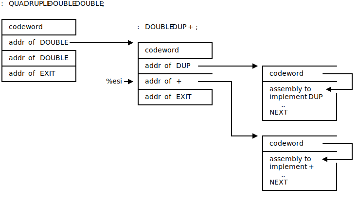

# **FORTH in Zig**

### Mixing old and new

---

## What is FORTH?

* append-only linked list of
* code fragments (flexible array members)
* with threaded interpreter to jump around

```asm
: DOUBLE ( n -- n ) DUP + ;
: QUADRUPLE ( n -- n ) DOUBLE DOUBLE ;
10 QUADRUPLE 2 + .
42
```

---



---

# Successive approaches

* `jonesforth.S`: `lodsl; jmp *(%eax)`
* `4th.c`: `target = *ip++; goto **target`
* `5th.c`: `__attribute__((musttail)) return ...`
* `5th.zig`: `return @call(.always_tail, ...`

---
<style scoped>
section { columns: 2; display: block; }
h1 { column-span: all; }
h2 { break-before: column; }
</style>

# How does it work?
## Ideally
```c
const Instr = packed union {
    code: *const fn (...) void,
    literal: isize,
    word: [*]const Instr,
};

const Word = extern struct {
    link: ?*const Word,
    flag: u8,
    name: [F_LENMASK]u8 align(1),
    code: []Instr,  # NOT CONTIGUOUS!
};
```

## Practically
Helper emulates flexible
array member with
```c
var instrs: [n + 5]Instr;
const p: *Word = @ptrCast(&instrs[0]);
```

---

# zig < ZORTH < python 3.12

```bash
$ hyperfine -N 'python fibonacci.py'
Benchmark 1: python fibonacci.py
  Time (mean ± σ):      58.5 ms ±  18.8 ms    [User: 39.9 ms, System: 11.6 ms]
  Range (min … max):    34.9 ms … 116.0 ms    25 runs

$ hyperfine -N './zig-out/bin/5th < ./fibonacci.fs' 
Benchmark 1: ./zig-out/bin/5th < ./fibonacci.fs
  Time (mean ± σ):       3.1 ms ±   3.5 ms    [User: 0.5 ms, System: 0.6 ms]
  Range (min … max):     0.4 ms …  53.2 ms    6452 runs

$ hyperfine -N ./fibonacci 
Benchmark 1: ./fibonacci
  Time (mean ± σ):       2.6 ms ±   2.5 ms    [User: 0.4 ms, System: 0.7 ms]
  Range (min … max):     0.5 ms …  22.2 ms    541 runs
```

---

# References

* [jonesforth](https://rwmj.wordpress.com/tag/jonesforth/) for the origin story
* [Forth: The programming language that writes itself](https://ratfactor.com/forth/the_programming_language_that_writes_itself.html)
* [Why not try Zig next?](https://bur.gy/2024/08/31/why-not-zig.html) (shameless plug)
* [Starting FORTH](https://www.forth.com/starting-forth/) to go deeper
* Discord conversations [1](https://discord.com/channels/605571803288698900/1254033012299927573/1254033012299927573), [2](https://discord.com/channels/605571803288698900/1274691126833578087/1274691126833578087), and [3](https://discord.com/channels/605571803288698900/1279771948447961148/1279771948447961148)
